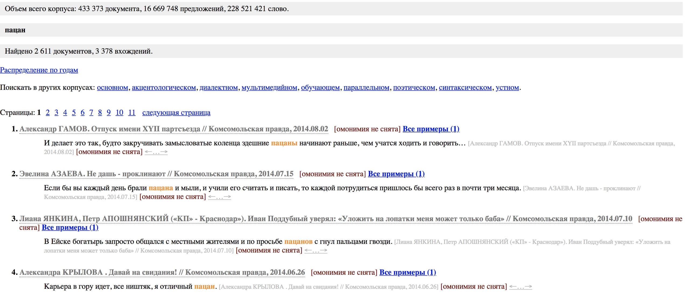

## Статистическо-интертекстуальный анализ текстов песен Макса Коржа

проект by конфуций от каждый день на каждый день!

### Структура исследования ###
Один из наших тезисов - песни Макса Коржа приближены к реалиям русских людей. 
Автор использует слова, которые употребляет практически каждый (особенно среди молодых людей).
 
### Использованные для исследования инструменты

1. `antconc`: какие слова повторяются в выборке, конкордансы (сочетания) этих слов
2. `google ngrams`: периоды частотного употребления этих слов/сочетаний
3. `национальный корпус русского языка`: разные подкорпусы (какому типу речи более свойственны эти сочетания)
4. `github pages`: создание сайта и репозитория с readme

### Функции в команде

- _Данилова Галина_: работа с сайтом, структурирование материала
- _Ермолина Дарья_: осуществление выборки песен, обработка в материала в антконке
- _Морозова Анна_: анализ google ngrams и НКРЯ
- _Фомичева Виктория_: осуществление обработки материала в google ngrams, формулировка темы и задачи исследования

#### В качестве примера можно взять слово “пацан”. Как видно на скрине Google Ngram Viewer, это слово становилось все популярнее, начиная с 1990-х годов. 

**1. слово "пацан" в google n-grams**

Как мы знаем, конец XX века был сложным для страны - развал СССР, народные волнения. Перестройка отчасти напоминает революцию, силой которой становятся не интеллигенция, не чиновники, а народ - нижний и средний классы. В период подъема этих групп язык как гибкая система менялся, соответственно, более употребимыми становились слова из повседневной речи большинства. 

**2. concordance слова "пацан" во всех песнях**

**Так, слово “пацан” чаще всего встречается в устном корпусе НКРЯ. Стоит отметить, что оно употребляется в газетах, однако в абсолютном большинстве случаев в виде цитат каких-либо людей.**

**3. слово "пацан" в НКРЯ**

**4. concordance слова "пацаны" во всех песнях**

**5. сочетание слов "темнота" и "ожидание" в НКРЯ**

**6. все частотные слова в тексте песни "слово пацана"**

**7. слово "братишка" в google n-grams**

**8. слово "братишка" в НКРЯ**

**9. сочетание слов "пьяный" и "дождь" в НКРЯ**

**10. все частотные слова в тексте песни "мотылек"**

### спасибо за внимание!!

