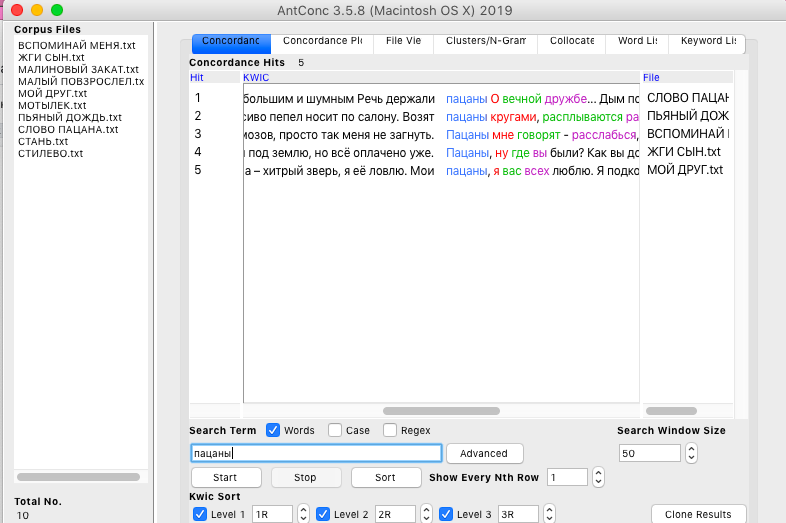
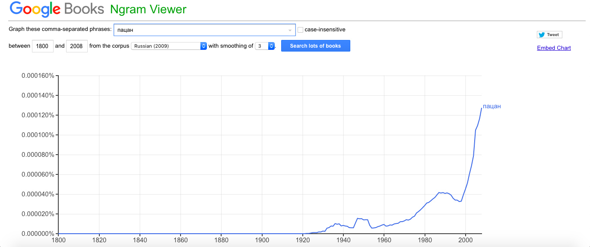
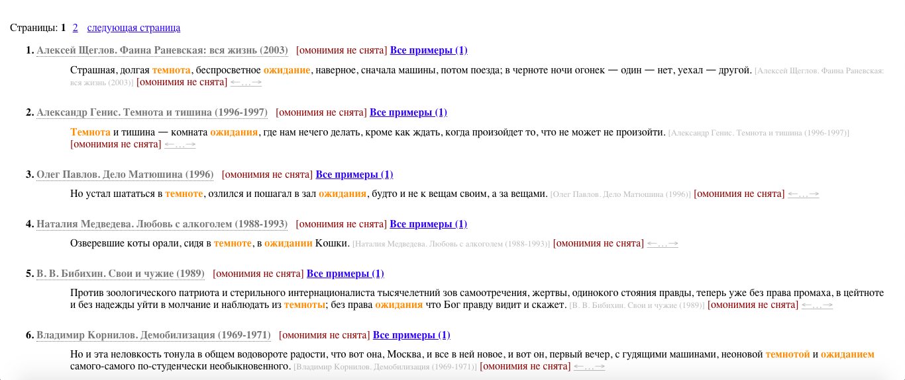
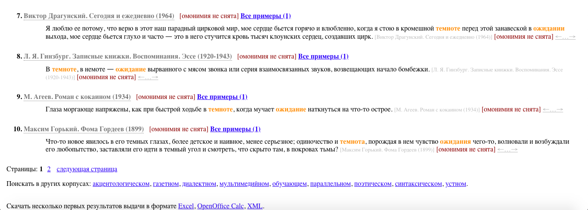
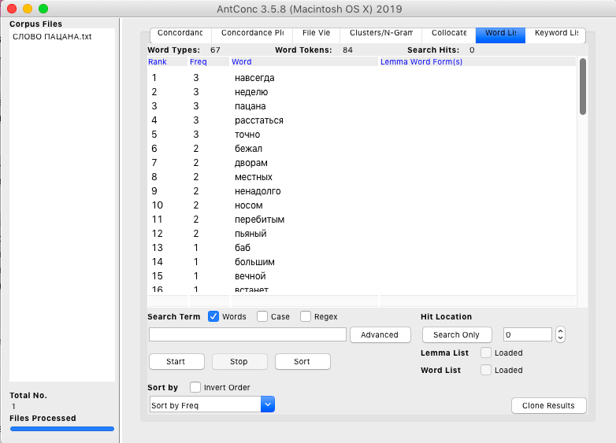
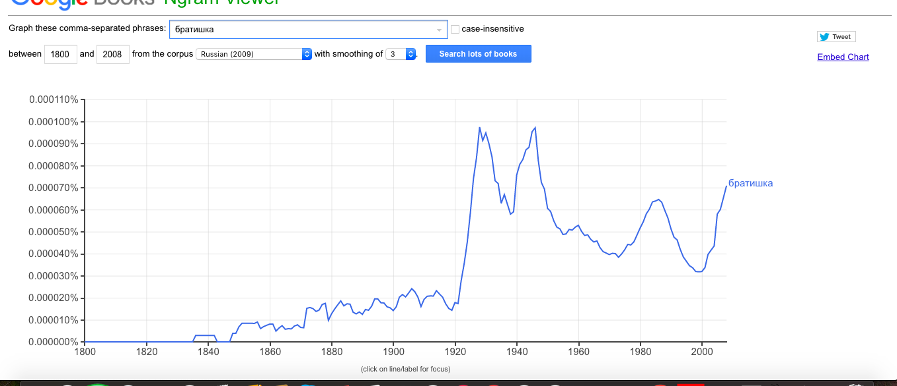
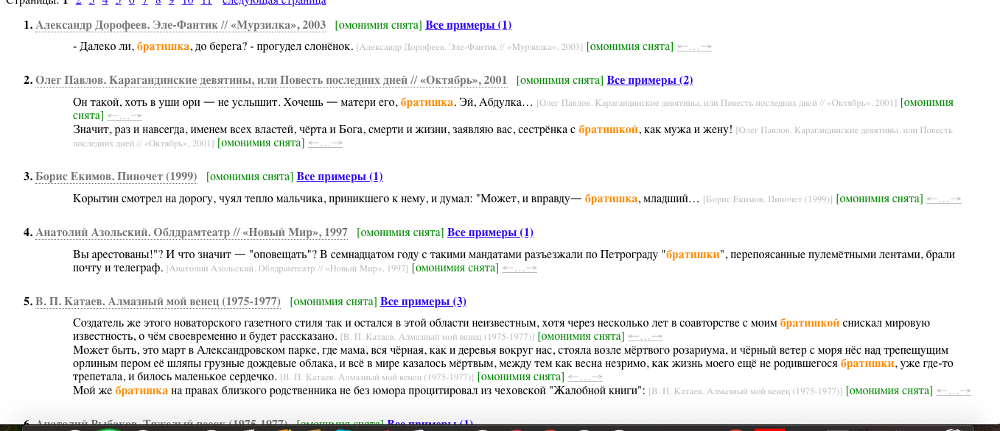
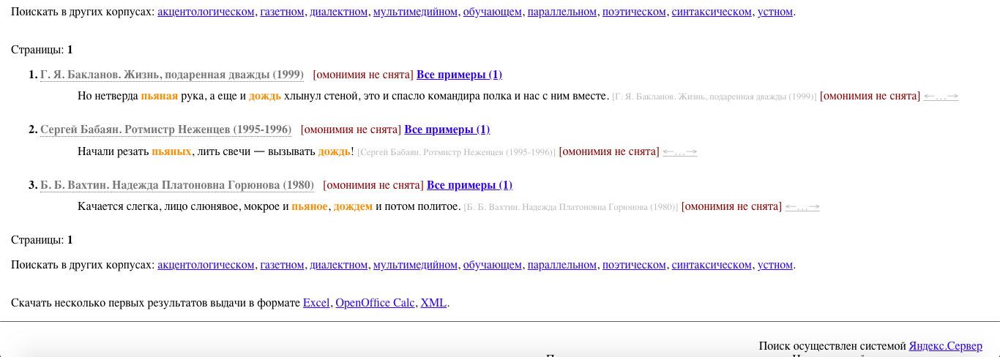
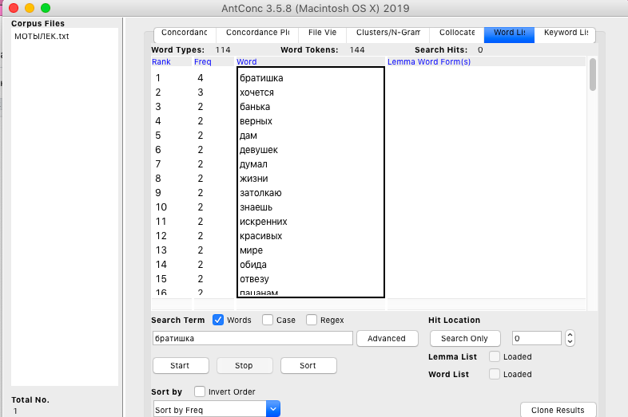

## Статистическо-интертекстуальный анализ текстов песен Макса Коржа

проект by конфуций от каждый день на каждый день!


### Структура исследования ###
1. _antconc_: какие слова повторяются в выборке, конкордансы (сочетания) этих слов
2. _google ngrams_: периоды частотного употребления этих слов/сочетаний
3. _национальный корпус русского языка_: разные подкорпусы (какому типу речи более свойственны эти сочетания)
4. _github pages_ 
 

### Использованные для исследования инструменты

1. `antconc`: какие слова повторяются в выборке, конкордансы (сочетания) этих слов
2. `google ngrams`: периоды частотного употребления этих слов/сочетаний
3. `национальный корпус русского языка`: разные подкорпусы (какому типу речи более свойственны эти сочетания)
4. `github pages`: создание сайта и репозитория с readme


### Функции в команде

- _Ермолина Дарья_: осуществление выборки песен, обработка в материала в антконке
- _Данилова Галина_: работа с сайтом, структурирование материала
- _Морозова Анна_: анализ google ngrams и НКРЯ
- _Фомичева Виктория_: осуществления обработки материала в google ngrams, формулировка темы и задачи исследования

**1. concordance слова "пацаны" во всех песнях**


**2. concordance слова "пацан" во всех песнях**


**3. слово "пацан" в google n-grams**


**4. сочетание слов "темнота" и "ожидание" в НКРЯ**



**5. все частотные слова в тексте песни "слово пацана"**


**6. слово "братишка" в google n-grams**


**6. слово "братишка" в НКРЯ**


**7. сочетание слов "пьяный" и "дождь" в НКРЯ**


**8. все частотные слова в тексте песни "мотылек"**


```markdown
# Header 1
## Header 2
### Header 3

- Bulleted
- List

1. Numbered
2. List

**Bold** and _Italic_ and `Code` text

[Link](url) and 
```

For more details see [GitHub Flavored Markdown](https://guides.github.com/features/mastering-markdown/).


### Support or Contact

Having trouble with Pages? Check out our [documentation](https://help.github.com/categories/github-pages-basics/) or [contact support](https://github.com/contact) and we’ll help you sort it out.
