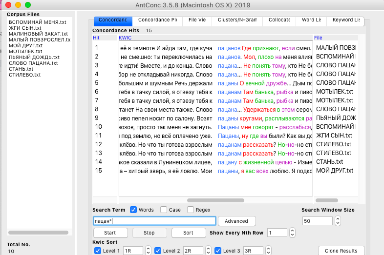

## Статистическо-интертекстуальный анализ текстов песен Макса Коржа

**Структура исследования:** 
1. _antconc_: какие слова повторяются в выборке, конкордансы (сочетания) этих слов
2. _google ngrams_: периоды частотного употребления этих слов/сочетаний
3. _национальный корпус русского языка_: разные подкорпусы (какому типу речи более свойственны эти сочетания)
4. _github pages_ 
 

### Использованные для исследования инструменты

```markdown

1. `antconc`: какие слова повторяются в выборке, конкордансы (сочетания) этих слов
2. `google ngrams`: периоды частотного употребления этих слов/сочетаний
3. `национальный корпус русского языка`: разные подкорпусы (какому типу речи более свойственны эти сочетания)
4. `github pages`: создание сайта и репозитория с readme


# Header 1
## Header 2
### Header 3

- Bulleted
- List

1. Numbered
2. List

**Bold** and _Italic_ and `Code` text

[Link](url) and 
```

For more details see [GitHub Flavored Markdown](https://guides.github.com/features/mastering-markdown/).

### Jekyll Themes

Your Pages site will use the layout and styles from the Jekyll theme you have selected in your [repository settings](https://github.com/mermdart/project/settings). The name of this theme is saved in the Jekyll `_config.yml` configuration file.

### Support or Contact

Having trouble with Pages? Check out our [documentation](https://help.github.com/categories/github-pages-basics/) or [contact support](https://github.com/contact) and we’ll help you sort it out.





